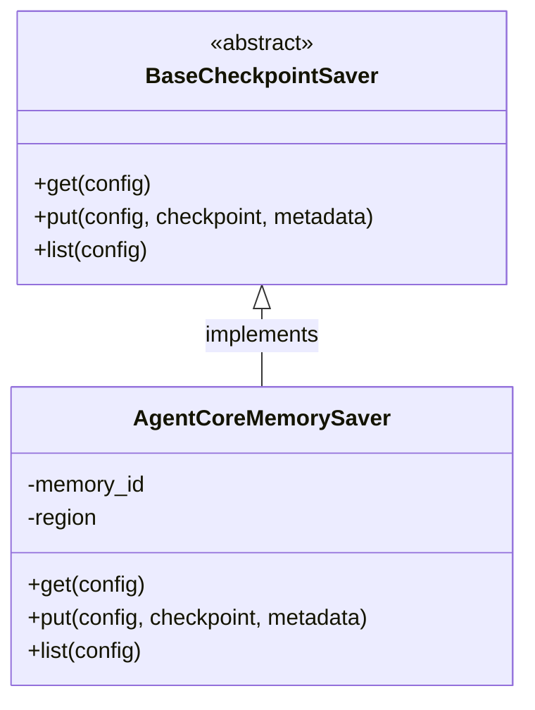
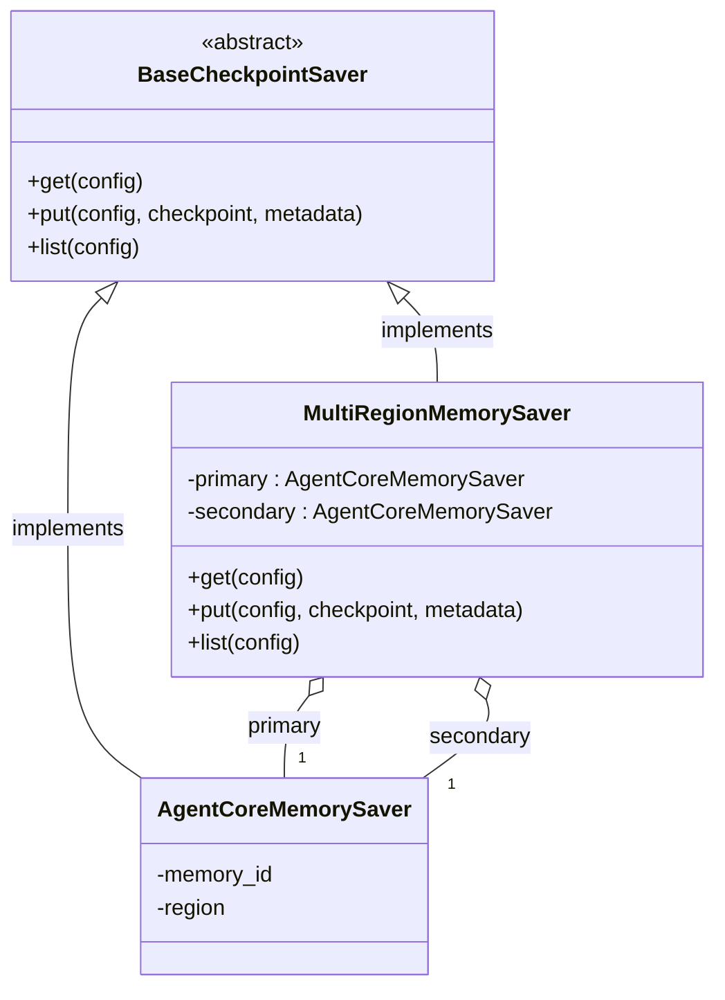
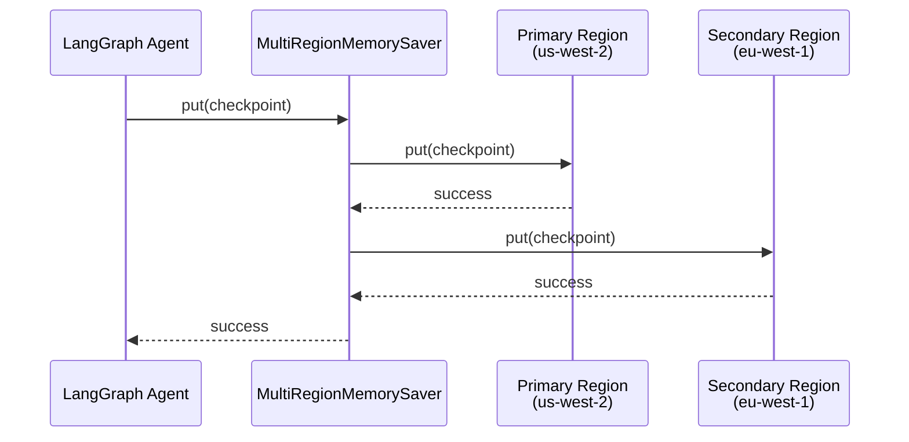

# Multi-Region Disaster Recovery for AgentCore Memory

## Current Implementation

LangGraph provides `AgentCoreMemorySaver` — an open-source checkpoint saver that persists LangGraph agent state to AWS Bedrock AgentCore Memory in a single region.



All LangGraph agents use a `BaseCheckpointSaver` to persist conversation state. Today, `AgentCoreMemorySaver` writes to a single region — if that region goes down, conversation history is lost.

---

## DR-Ready Implementation

`MultiRegionMemorySaver` implements the same `BaseCheckpointSaver` interface and internally delegates to two `AgentCoreMemorySaver` instances — one per region.



Because it implements the same base interface, **it is a drop-in replacement** — existing code only needs to swap the checkpointer, no other changes required.

---

## How a Single Write Reaches Both Regions



Reads only go to the primary region — no performance penalty on the read path.

---

## Drop-In Replacement

Existing codebases using `AgentCoreMemorySaver` directly can enable DR with a one-line swap:

```python
# Before — single region
checkpointer = AgentCoreMemorySaver(memory_id, region_name="us-west-2")

# After — multi-region DR
checkpointer = MultiRegionMemorySaver(
    primary_region="us-west-2",
    secondary_region="eu-west-1",
    primary_memory_id=primary_id,
    secondary_memory_id=secondary_id,
)

# Everything else stays the same
agent = create_react_agent(model=llm, tools=tools, checkpointer=checkpointer)
```

No changes to agent logic, tools, or invocation code.

---

## Performance Considerations

| Operation | Latency Impact | Reason |
|-----------|---------------|--------|
| **Read** | None | Reads from primary region only |
| **Write** | ~2x per write | Must write to both regions |

### Secondary Region Write Strategy: Sync vs Async

| | Synchronous | Asynchronous |
|---|---|---|
| **How it works** | Write to primary, then write to secondary, return after both complete | Write to primary, fire secondary write in background, return after primary completes |
| **Consistency** | Strong — both regions guaranteed in sync on return | Eventual — secondary may lag briefly behind primary |
| **Latency** | Higher — adds full secondary region round-trip to every write | Lower — only primary region latency on the hot path |
| **Failure handling** | Simple — if either fails, caller gets an error immediately | Complex — need retry queues, dead-letter handling, reconciliation |
| **Data loss risk** | None (if write succeeds, both regions have the data) | Small window — if primary region fails before async replication completes |

**Current implementation uses synchronous writes** for simplicity and strong consistency. For latency-sensitive workloads, an async strategy with a background replication queue could be considered as a future optimization.
